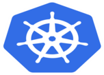

# Kubernetes-Docker-WebApp
An Easy-to-Use and convenient WebApp that enables you to use Docker and Kubernetes with just  few clicks!!!!!
---
Follow the below steps to configure the same setup on your system:
1. Install Apache webserver software on RHELv8 using the following command: 
`yum install httpd -y` 
2. Clone this repo into your operating system using the following command: 
`git clone https://github.com/shubhambhardwaj007/Kubernetes-Docker-WebApp.git`
3. Put <b>docker-kubernetes-webapp</b> Folder (present inside Backend folder in this repo) inside <b>/var/www/cgi-bin/</b> folder. 
`cd Kubernetes-Docker-WebApp` 
`cp -r ./Backend/ /var/www/cgi-bin/` 
4. Put <b>FrontEnd</b> Folder inside <b>/var/www/html</b> so that it can be accessed it from web browser. 
`cp -r ./Frontend /var/www/html/`
5. Finally, Start Httpd webserver service and make its service permanent using following command: 
`systemctl enable httpd --now`
6. Now you can easily access this webApp over web browser by using following url: 
`http://<IP ADDRESS OF YOUR SYSTEM>/FrontEnd/index.html`
7. Enjoy!!!
